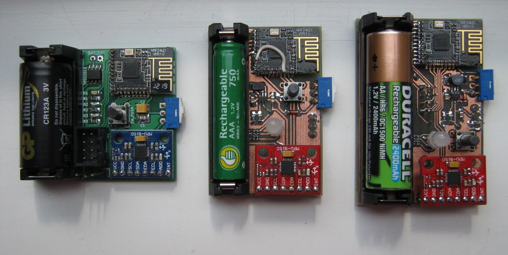
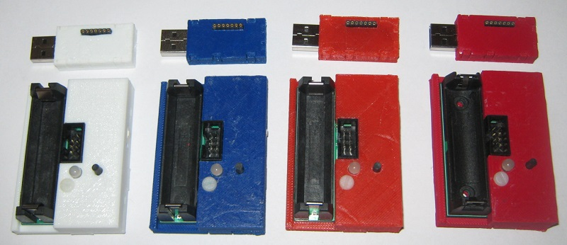

This project implements a 3 axis wireless gyro. The hardware consists of two parts: a tracker with sensors and a USB dongle.

The data received from the sensors can be passed to the PC through a USB dongle which enumerates as a joystick and mouse.

The tracker contains these ICs:

- Nordic Semiconductor nRF24LE1 MCU (8-bit 8051)
- InvenSense MPU-6050 (or MPU-9150) IMU (gyro and accelerometer)
- Asahi Kasei AK8975 (magnetometer)

The USB dongle uses a Nordic Semiconductor nRF24LU1+ 2.4GHz and does most of the numerical processing.

There are several variants of the tracker which vary in size and power source. The most practical variant runs off of a single AA battery and has a 3.3V boost regulator (MCP1640). Another variant uses a CR123A lithium battery without a regulator.

The tracker is designed around modules (MCU and sensors) which can be easily found on ebay or similar online shops.

The code can be compiled with sdcc (Small Device C Compiler) and flashed to the Nordic nRF chips using nrfburn: https://github.com/nodep/nrfburn

The project contains design files (OpenSCAD and stl) for 3D printed enclosures for the tracker and the dongle.

